<!--
SPDX-FileCopyrightText: Copyright (c) 2024-2025 NVIDIA CORPORATION & AFFILIATES. All rights reserved.
SPDX-License-Identifier: Apache-2.0
-->

# Visualization and Plotting with AIPerf

Generate PNG visualizations from AIPerf profiling data with automatic mode detection, NVIDIA brand styling, and support for multi-run comparisons and single-run analysis.

## Overview

The `aiperf plot` command automatically detects whether to generate multi-run comparison plots or single-run time series analysis based on your directory structure. It integrates GPU telemetry and timeslice data when available.

**Key Features:**
- Automatic mode detection (multi-run comparison vs single-run analysis)
- GPU telemetry integration (power, utilization, memory, temperature)
- Timeslice support (performance evolution across time windows)
- Configurable plots via `~/.aiperf/plot_config.yaml`

## Quick Start

```bash
# Analyze a single profiling run
aiperf plot <single_run_name>

# Compare multiple runs in a directory
aiperf plot <run_directory>

# Compare all runs across multiple directories
aiperf plot <dir1> <dir2> <dir3>

# Compare specific runs
aiperf plot <run1> <run2> <run3>

# Specify custom output location
aiperf plot <path> --output <output_directory>

# Launch interactive dashboard for exploration
aiperf plot <path> --dashboard

# Use dark theme
aiperf plot <path> --theme dark
```

**Output directory logic:**
- If `--output` specified: uses that path
- Otherwise: `<first_input_path>/plots/`
- Default (no paths): `./artifacts/plots/`

**Customize plots**: Edit `~/.aiperf/plot_config.yaml` (auto-created on first run) to enable/disable plots or customize visualizations. See [Plot Configuration](#plot-configuration-yaml) for details.

## Visualization Modes

The plot command automatically detects visualization mode based on directory structure:

### Multi-Run Comparison Mode

Compares metrics across multiple profiling runs to identify optimal configurations.

**Auto-detected when:**
- Directory contains multiple run subdirectories, OR
- Multiple paths specified as arguments

**Example:**
```text
artifacts/sweep_qwen/
├── Qwen3-0.6B-concurrency1/
├── Qwen3-0.6B-concurrency2/
└── Qwen3-0.6B-concurrency4/
```

**Default plots (3):**
1. **TTFT vs Throughput** - Time to first token vs request throughput
2. **Token Throughput per GPU vs Latency** - GPU efficiency vs latency (requires GPU telemetry)
3. **Token Throughput per GPU vs Interactivity** - GPU efficiency vs TTFT (requires GPU telemetry)

> [!TIP]
> Use [Experiment Classification](#experiment-classification) to assign semantic colors (grey for baselines, green for treatments) for clearer visual distinction.

#### Example Visualizations

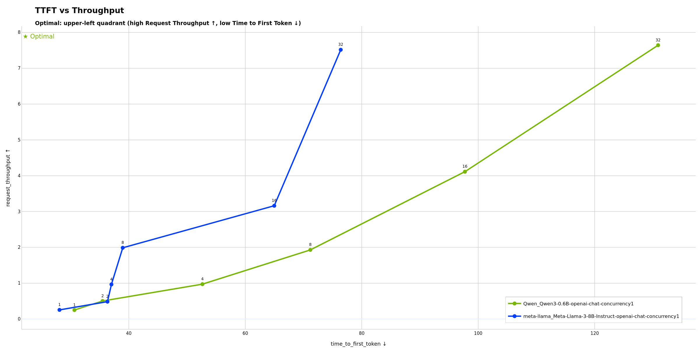

Shows how time to first token varies with request throughput across concurrency levels. **Potentially useful for finding the sweet spot between responsiveness and capacity**: ideal configurations maintain low TTFT even at high throughput. If TTFT increases sharply at certain throughput levels, this may indicate a prefill bottleneck (batch scheduler contention or compute limitations).

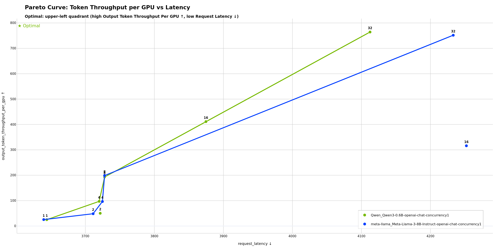

Highlights optimal configurations on the Pareto frontier that maximize GPU efficiency while minimizing latency. **Points on the frontier are optimal; points below are suboptimal** configurations. Potentially useful for choosing GPU count and batch sizes to maximize hardware ROI. A steep curve may indicate opportunities to improve latency with minimal throughput loss, while a flat curve can suggest you're near the efficiency limit.

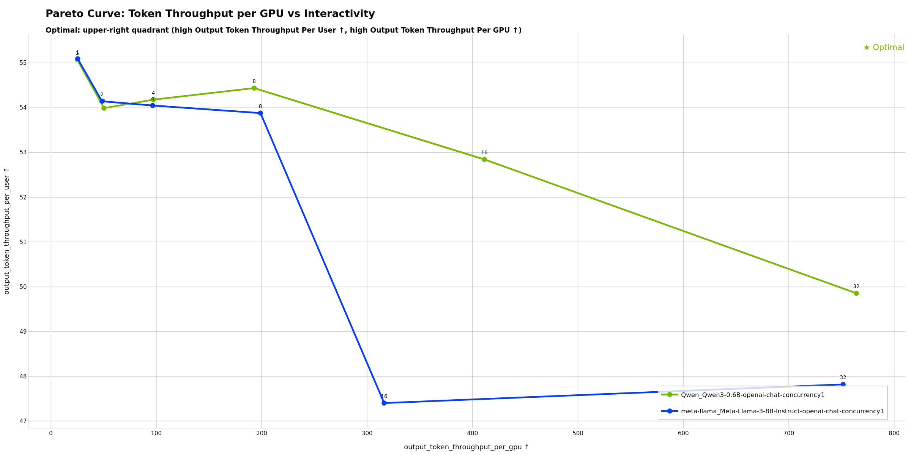

Shows the trade-off between GPU efficiency and interactivity (TTFT). **Potentially useful for determining max concurrency before user experience degrades**: flat regions show where adding concurrency maintains interactivity, while steep sections may indicate diminishing returns. The "knee" of the curve can help identify where throughput gains start to significantly hurt responsiveness.

### Single-Run Analysis Mode

Analyzes performance over time for a single profiling run.

**Auto-detected when:**
- Directory contains `profile_export.jsonl` directly

**Example:**
```text
artifacts/single_run/
└── profile_export.jsonl
```

**Default plots (4+):**
1. **TTFT Over Time** - Time to first token per request
2. **Inter-Token Latency Over Time** - ITL per request
3. **Request Latency Over Time** - End-to-end latency progression
4. **Dispersed Throughput Over Time** - Continuous token generation rate

**Additional plots (when data available):**
- Timeslice plots (when `--slice-duration` used during profiling)
- GPU telemetry plots (when `--gpu-telemetry` used during profiling)

#### Example Visualizations

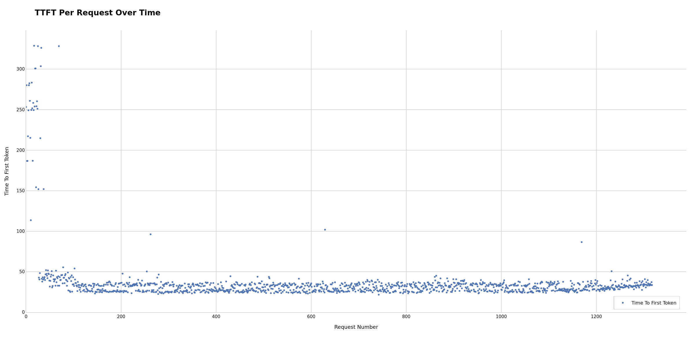

Time to first token for each request, revealing prefill latency patterns and potential warm-up effects. **Initial spikes may indicate cold start; stable later values show steady-state performance**. Potentially useful for determining necessary warmup period or identifying warmup configuration issues. Unexpected spikes during steady-state can suggest resource contention, garbage collection pauses, or batch scheduler interference.

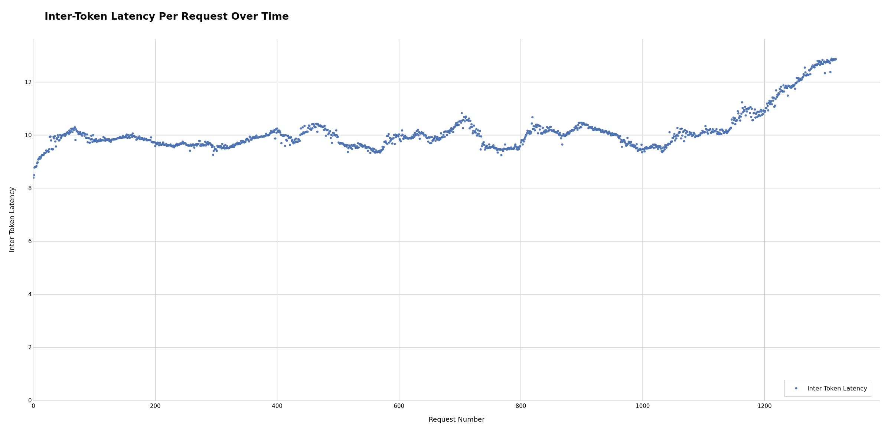

Inter-token latency per request, showing generation performance consistency. **Consistent ITL may indicate stable generation; variance can suggest batch scheduling issues**. Potentially useful for identifying decode-phase bottlenecks separate from prefill issues. If ITL increases over time, this may indicate KV cache memory pressure or growing batch sizes causing decode slowdown.

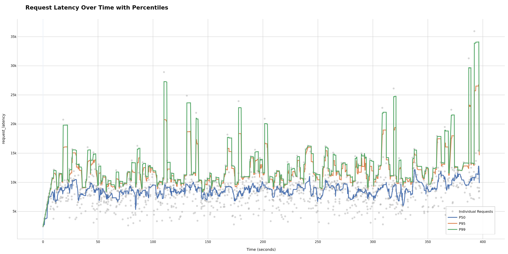

End-to-end latency progression throughout the run. **Overall system health check**: ramp-up at the start is normal, but sustained increases may indicate performance degradation. Potentially useful for identifying if your system maintains performance or degrades over time. Sudden jumps may correlate with other requests completing or starting, potentially revealing batch scheduling patterns.

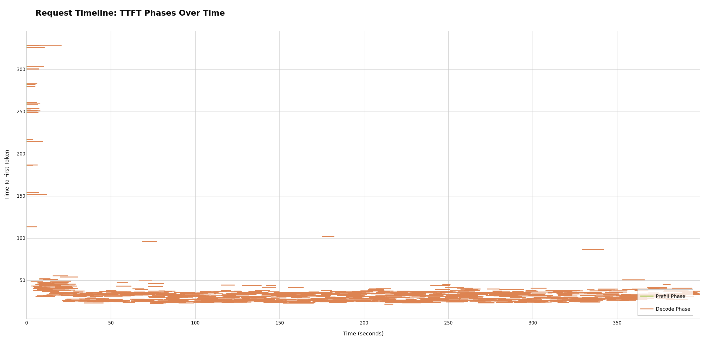

Individual requests plotted as lines spanning their duration from start to end. **Visualizes request scheduling and concurrency patterns**: overlapping lines show concurrent execution, while gaps may indicate scheduling delays. Dense packing can suggest efficient utilization; sparse patterns may suggest underutilized capacity or rate limiting effects.

### Dispersed Throughput

The **Dispersed Throughput Over Time** plot uses an event-based approach for accurate token generation rate visualization. Unlike binning methods that create artificial spikes, this distributes tokens evenly across their actual generation time:
- **Prefill phase** (request_start → TTFT): 0 tok/sec
- **Generation phase** (TTFT → request_end): constant rate = output_tokens / (request_end - TTFT)

This provides smooth, continuous representation that correlates better with server metrics like GPU utilization.

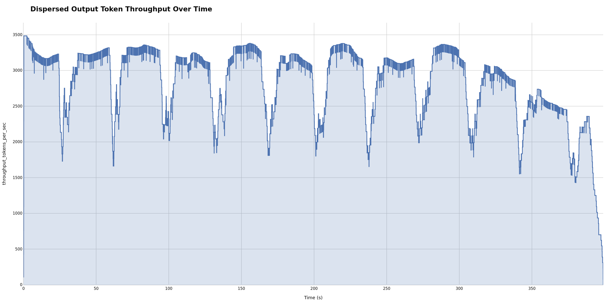

**Smooth ramps may show healthy scaling; drops can indicate bottlenecks**. Potentially useful for correlating with GPU metrics to identify whether bottlenecks are GPU-bound, memory-bound, or CPU-bound. A plateau may indicate you've reached max sustainable throughput for your configuration. Sudden drops can potentially correlate with resource exhaustion or scheduler saturation.

## Customization Options

### Plot Configuration YAML

Customize which plots are generated and how they appear by editing `~/.aiperf/plot_config.yaml`.

#### Enable/Disable Plots

**Multi-run plots:**
```yaml
visualization:
  multi_run_defaults:
    - pareto_curve_throughput_per_gpu_vs_latency
    - pareto_curve_throughput_per_gpu_vs_interactivity
    - ttft_vs_throughput
```

**Single-run plots:**
```yaml
visualization:
  single_run_defaults:
    - ttft_over_time
    - itl_over_time
    - dispersed_throughput_over_time
    # ... add or remove plots
```

#### Customize Plot Grouping

Multi-run comparison plots group runs to create colored lines/series. Customize the `groups:` field in plot presets:

**Group by model** (useful for comparing different models):
```yaml
multi_run_plots:
  ttft_vs_throughput:
    groups: [model]
```

**Group by directory** (useful for hierarchical experiments):
```yaml
multi_run_plots:
  ttft_vs_throughput:
    groups: [experiment_group]
```

**Group by run name** (default - each run is separate):
```yaml
multi_run_plots:
  ttft_vs_throughput:
    groups: [run_name]
```

> [!NOTE]
> When experiment classification is enabled, all multi-run plots automatically group by `experiment_group` to preserve treatment variants with semantic colors.

> [!TIP]
> See the CONFIGURATION GUIDE section in `~/.aiperf/plot_config.yaml` for detailed customization options.

### Experiment Classification

Classify runs as "baseline" or "treatment" for semantic color assignment in multi-run comparisons.

**Configuration** (`~/.aiperf/plot_config.yaml`):
```yaml
experiment_classification:
  baselines:
    - "*baseline*"     # Glob patterns
    - "*_agg_*"
  treatments:
    - "*treatment*"
    - "*_disagg_*"
  default: treatment   # Fallback when no match
```

**Result:**
- **Baselines**: Grey shades, listed first in legend
- **Treatments**: NVIDIA green shades, listed after baselines
- **Use case**: Clear visual distinction for A/B testing

> [!IMPORTANT]
> When enabled, **all multi-run plots automatically group by experiment_group** (directory name) to preserve individual treatment variants with semantic baseline/treatment colors.

**Pattern notes**: Uses glob syntax (`*` = wildcard), case-sensitive, first match wins.

#### Example

**Directory structure:**
```text
artifacts/
├── baseline_moderate_io_isl100_osl200_streaming/           # Grey
│   ├── concurrency_1/
│   └── concurrency_2/
├── treatment_large_context_isl500_osl50_streaming/         # Green
│   ├── concurrency_1/
│   └── concurrency_2/
└── treatment_long_generation_isl50_osl500_streaming/       # Blue
    ├── concurrency_1/
    └── concurrency_2/
```

**Result**: 3 lines in plots (1 baseline + 2 treatments, each with semantic colors)

**Advanced**: Use `group_extraction_pattern` to aggregate variants:
```yaml
group_extraction_pattern: "^(treatment_\d+)"  # Groups treatment_1_varA + treatment_1_varB → "treatment_1"
```

> [!TIP]
> See `src/aiperf/plot/default_plot_config.yaml` for all configuration options.

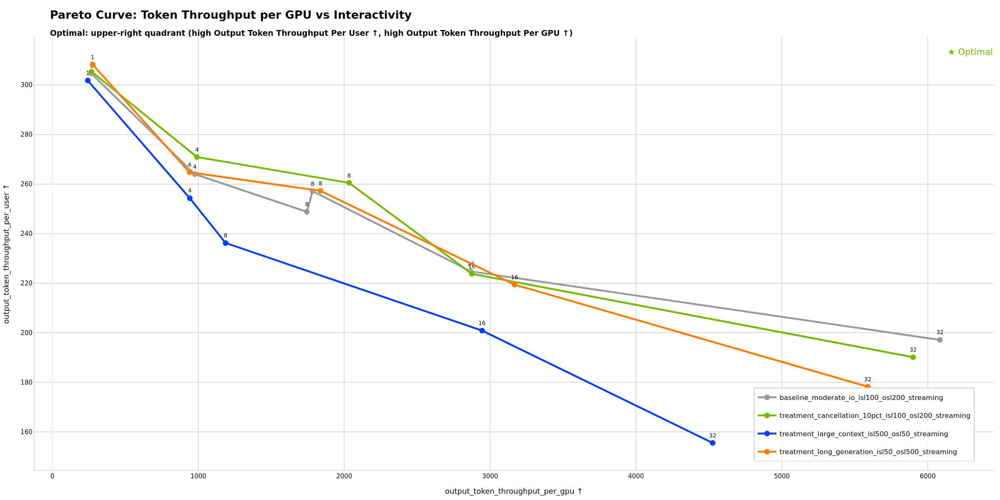

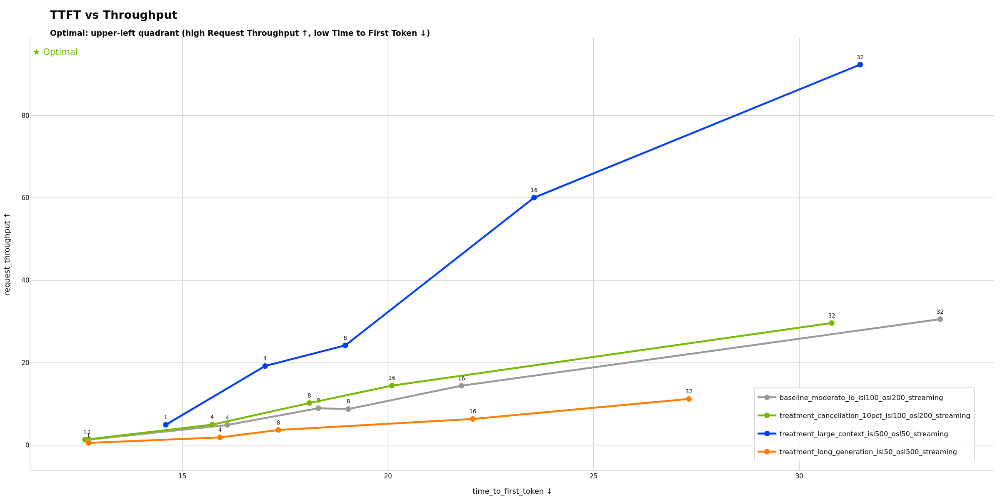

### Theme Options

```bash
# Light theme (default)
aiperf plot <path>

# Dark theme (for presentations)
aiperf plot <path> --theme dark
```

The dark theme uses a dark background optimized for presentations while maintaining NVIDIA brand colors.

#### Multi-Run Dark Theme

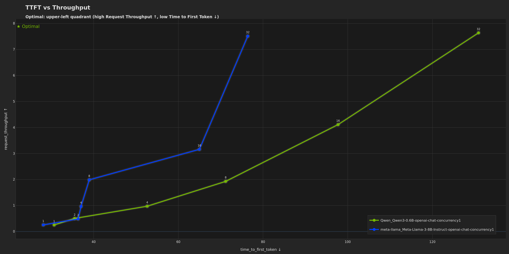

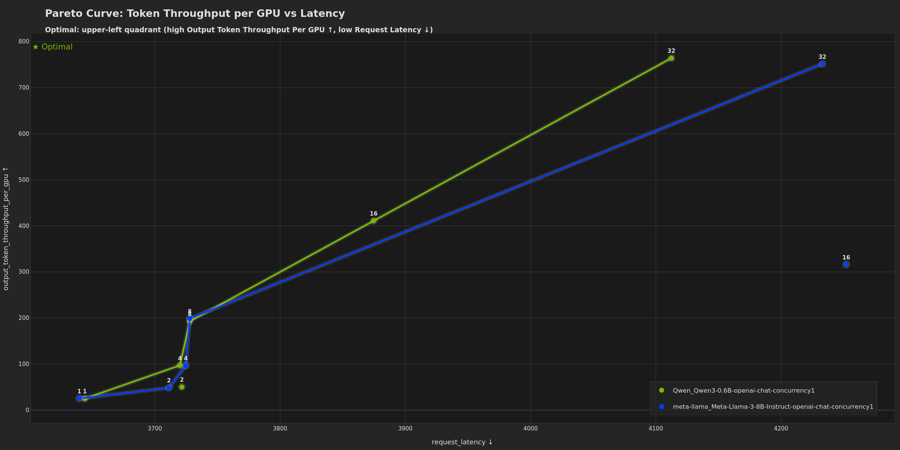

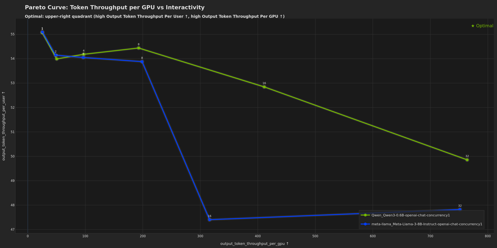

#### Single-Run Dark Theme

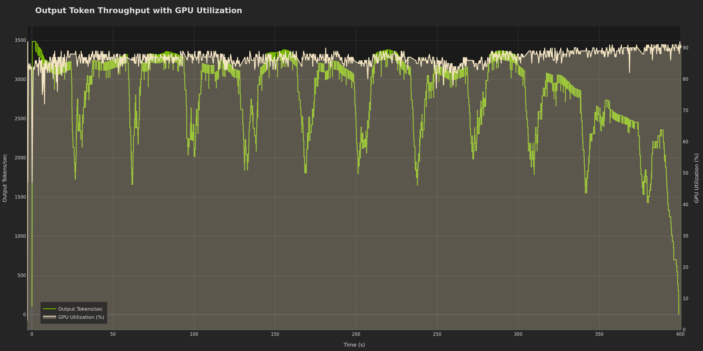

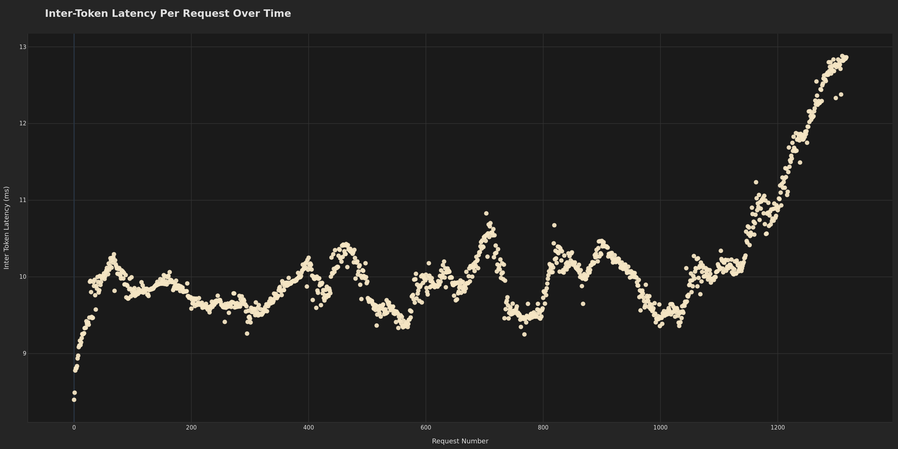

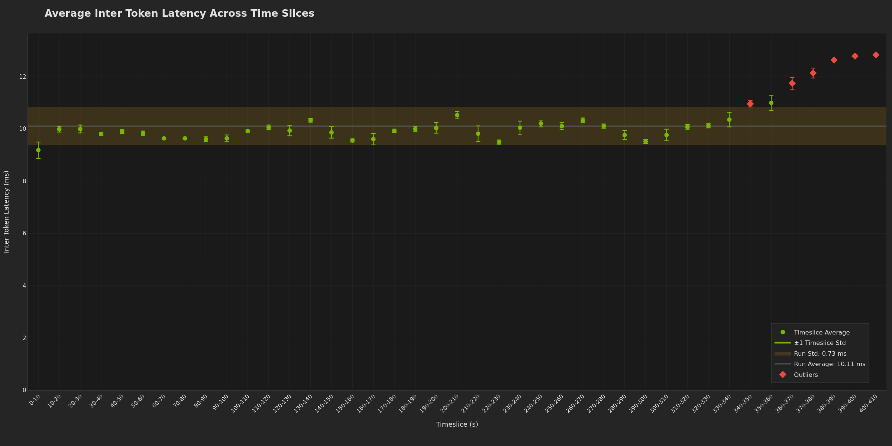

## Interactive Dashboard Mode

Launch an interactive localhost-hosted dashboard for real-time exploration of profiling data with dynamic metric selection, filtering, and visualization customization.

```bash
# Launch dashboard with default settings (localhost:8050)
aiperf plot --dashboard

# Specify custom port
aiperf plot --dashboard --port 9000

# Launch with dark theme
aiperf plot --dashboard --theme dark

# Specify data paths
aiperf plot path/to/runs --dashboard
```

**Key Features:**
- **Dynamic metric switching**: Toggle between avg, p50, p90, p95, p99 statistics in real-time
- **Run filtering**: Select which runs to display via checkboxes
- **Log scale toggles**: Per-plot X/Y axis log scale controls
- **Config viewer**: Click on data points to view full run configuration
- **Custom plots**: Add new plots with custom axis selections
- **Plot management**: Hide/show plots dynamically
- **Export**: Download visible plots as PNG bundle

The dashboard automatically detects visualization mode (multi-run comparison or single-run analysis) and displays appropriate tabs and controls. Press Ctrl+C in the terminal to stop the server.

> [!TIP]
> The dashboard runs on localhost only and requires no authentication. For remote access via SSH, use port forwarding: `ssh -L 8080:localhost:8080 user@remote-host`

> [!NOTE]
> Dashboard mode and PNG mode are separate. To generate both static PNGs and launch the dashboard, run the commands separately.

## Advanced Features

### GPU Telemetry Integration

**Multi-run plots** (when telemetry available):
- Token Throughput per GPU vs Latency
- Token Throughput per GPU vs Interactivity

**Single-run plots** (time series):
```text
- GPU Utilization Over Time
- GPU Memory Usage Over Time
```

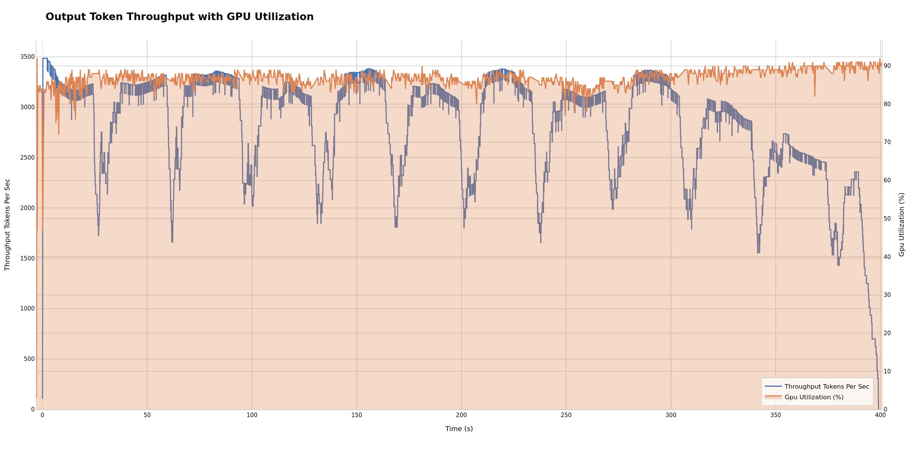

**Correlates compute resources with token generation performance**. High GPU utilization with low throughput may suggest compute-bound workloads (consider optimizing model/batch size). Low utilization with low throughput can indicate bottlenecks elsewhere (KV cache, memory bandwidth, CPU scheduling). Potentially useful for targeting >80% GPU utilization for efficient hardware usage.

> [!TIP]
> See the [GPU Telemetry Tutorial](gpu-telemetry.md) for setup and detailed analysis.

### Timeslice Integration

When timeslice data is available (via `--slice-duration` during profiling), plots show performance evolution across time windows.

**Generated timeslice plots:**
```text
- TTFT Across Timeslices
- ITL Across Timeslices
- Throughput Across Timeslices
- Latency Across Timeslices
```

**Timeslices enable easy outlier identification and bucketing analysis**. Each time window (bucket) shows avg/p50/p95 statistics, making it simple to spot which periods have outlier performance. Slice 0 often shows cold-start overhead, while later slices may reveal degradation. Flat bars across slices may indicate stable performance; increasing trends can suggest resource exhaustion. Potentially useful for quickly isolating performance issues to specific phases (warmup, steady-state, or degradation).

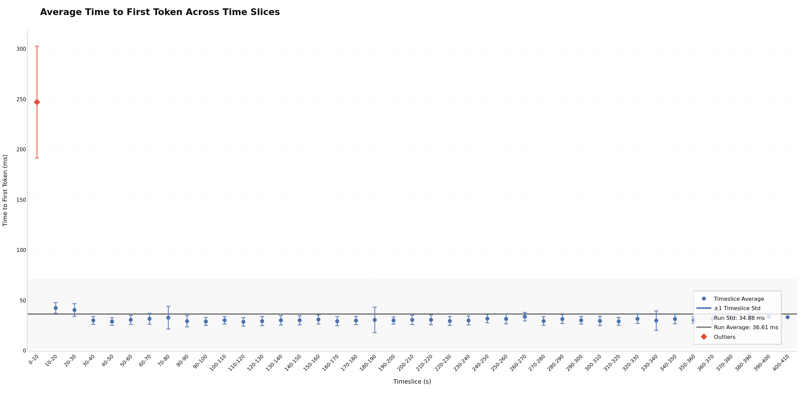

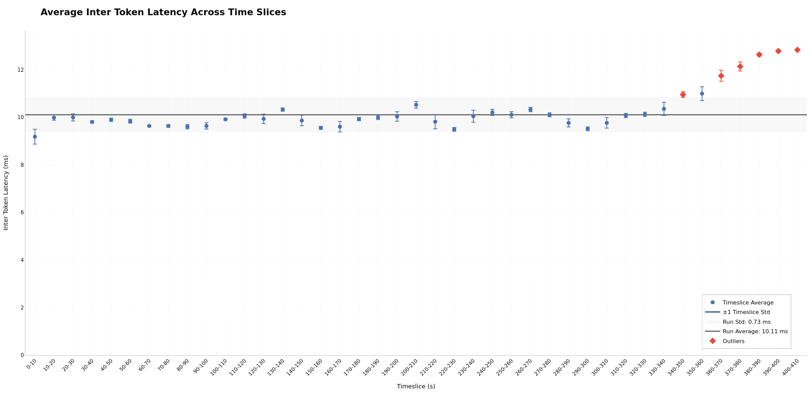

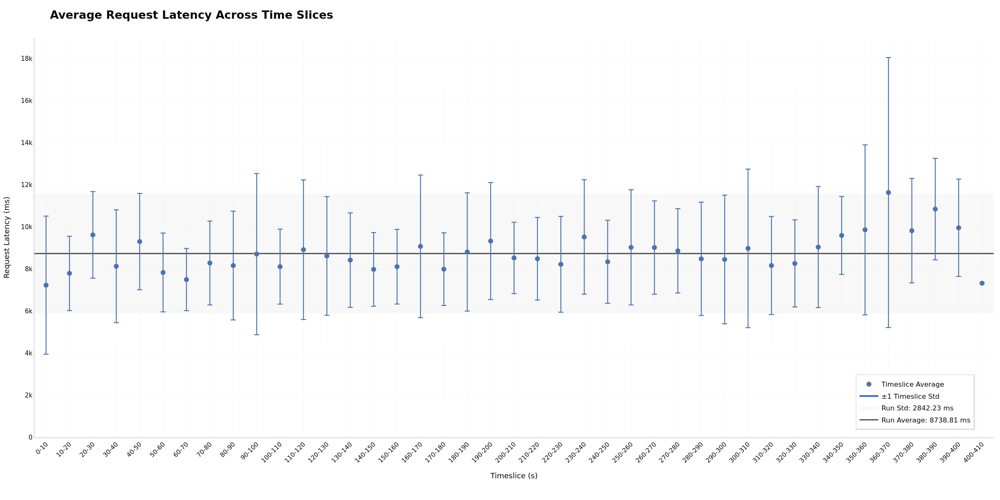

> [!TIP]
> See the [Timeslices Tutorial](timeslices.md) for configuration and analysis.

## Output Files

Plots are saved as PNG files in the output directory:

```
plots/
├── ttft_vs_throughput.png
├── pareto_curve_throughput_per_gpu_vs_latency.png
├── pareto_curve_throughput_per_gpu_vs_interactivity.png
├── ttft_over_time.png (single-run)
├── dispersed_throughput_over_time.png (single-run)
├── gpu_utilization_and_throughput_over_time.png (if GPU telemetry)
└── timeslices_*.png (if timeslice data available)
```

## Best Practices

> [!TIP]
> **Consistent Configurations**: When comparing runs, vary only one parameter (e.g., concurrency) while keeping others constant. This isolates the impact of that specific parameter.

> [!TIP]
> **Use Experiment Classification**: Configure [experiment classification](#experiment-classification) to distinguish baselines from treatments with semantic colors.

> [!TIP]
> **Include Warmup**: Use `--warmup-request-count` to ensure steady state before measurement, reducing noise in visualizations.

> [!WARNING]
> **Directory Structure**: Ensure consistent naming - runs to compare must be in subdirectories of a common parent.

> [!NOTE]
> **GPU Metrics**: GPU telemetry plots only appear when telemetry data is available. Ensure DCGM is running during profiling. See [GPU Telemetry Tutorial](gpu-telemetry.md).

## Troubleshooting

### No Plots Generated

**Solutions**:
- Verify input directory contains valid `profile_export.jsonl` files
- Check output directory is writable
- Review console output for error messages

### Missing GPU Plots

**Solutions**:
- Verify `gpu_telemetry_export.jsonl` exists and contains data
- Ensure DCGM exporter was running during profiling
- Check telemetry data is present in profile exports

### Incorrect Mode Detection

**Solutions**:
- Check directory structure:
  - Multi-run: parent directory with multiple run subdirectories
  - Single-run: directory with `profile_export.jsonl` directly inside
- Ensure all run directories contain valid `profile_export.jsonl` files

## Related Documentation

- [Working with Profile Exports](working-with-profile-exports.md) - Understanding profiling data format
- [GPU Telemetry](gpu-telemetry.md) - Collecting GPU metrics
- [Timeslices](timeslices.md) - Time-windowed performance analysis
- [Request Rate and Concurrency](request-rate-concurrency.md) - Load generation strategies
